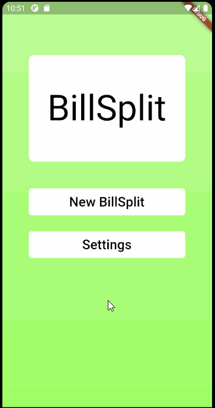
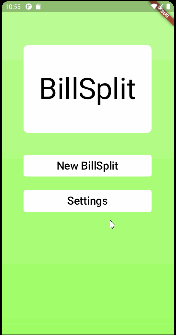

# BillSplit

A simple Flutter app to calculate how much money each person needs to pay on a bill.

# Usage

Set your city's sales tax by going to settings.

Then add your friends to a new SplitBill and record how much each item costs.

